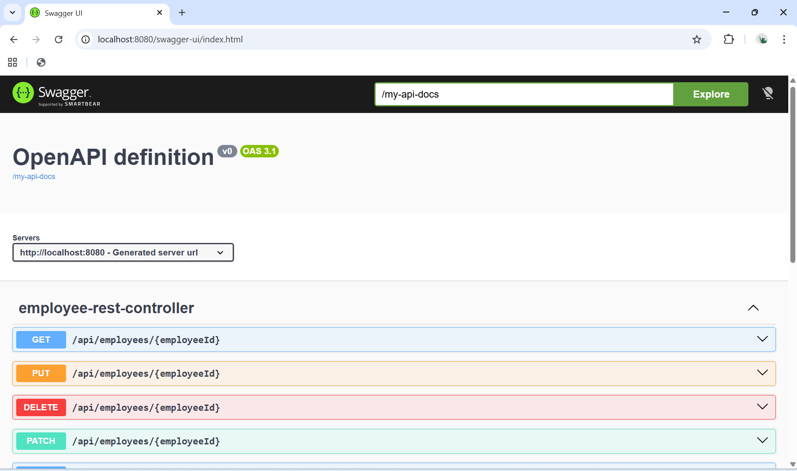
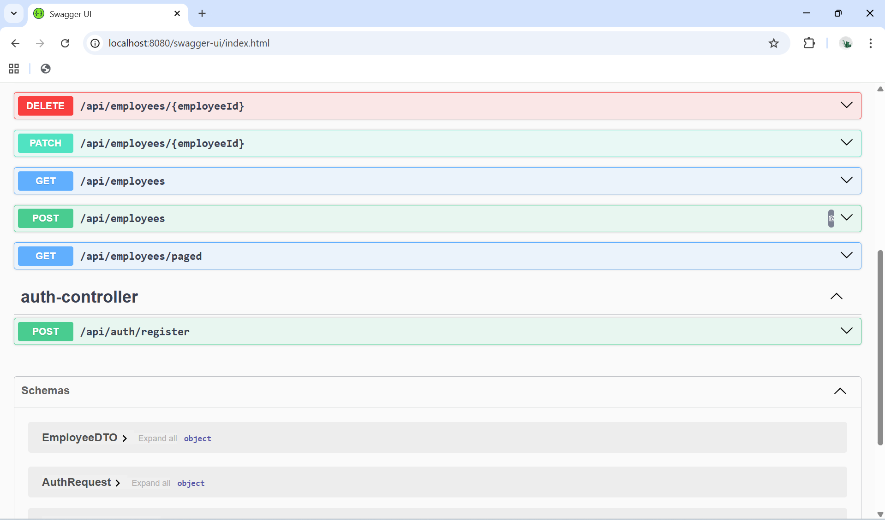
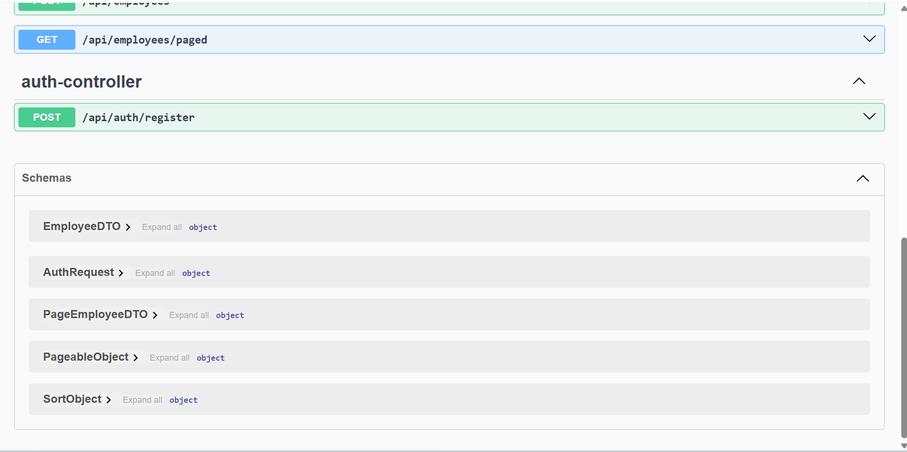
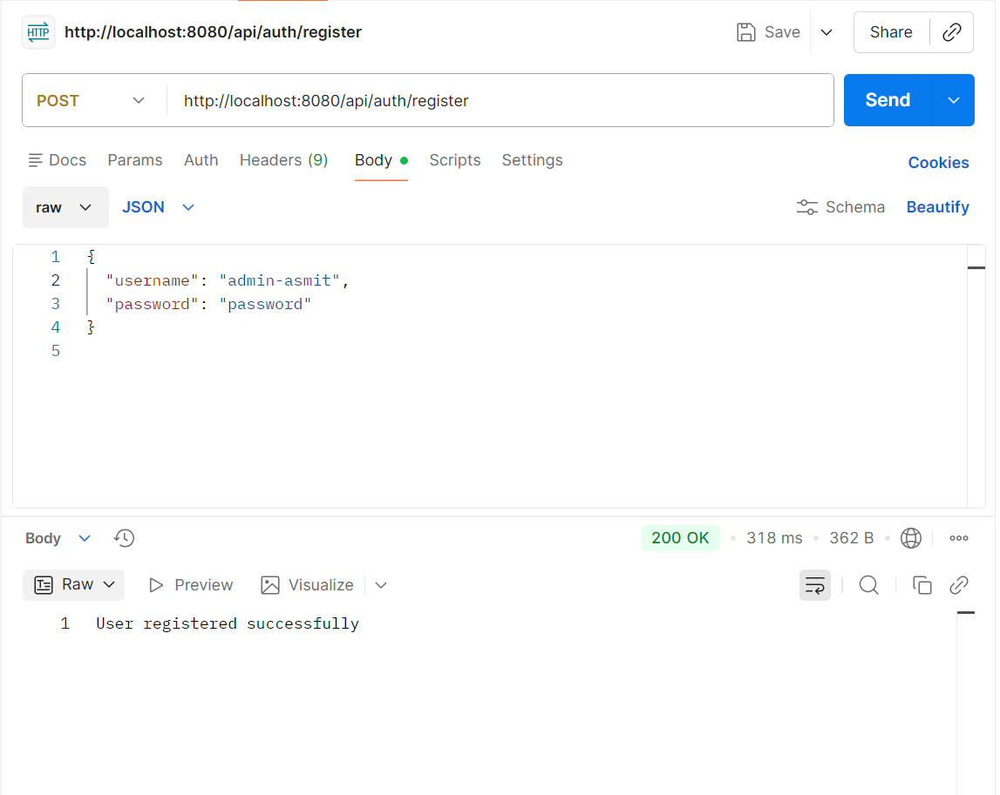
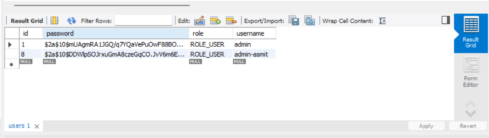
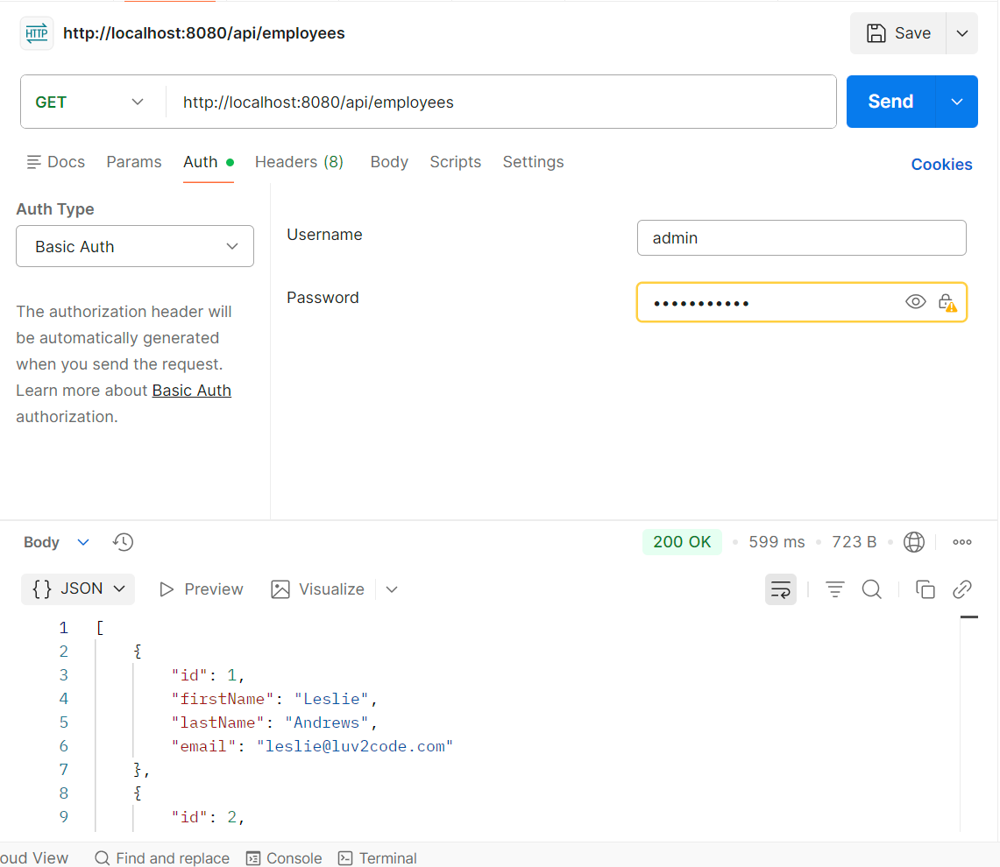
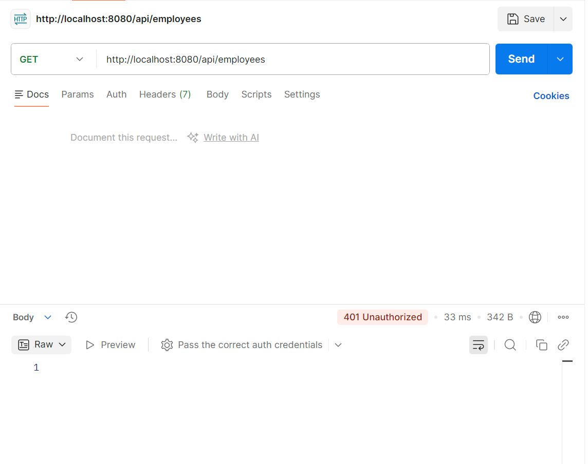
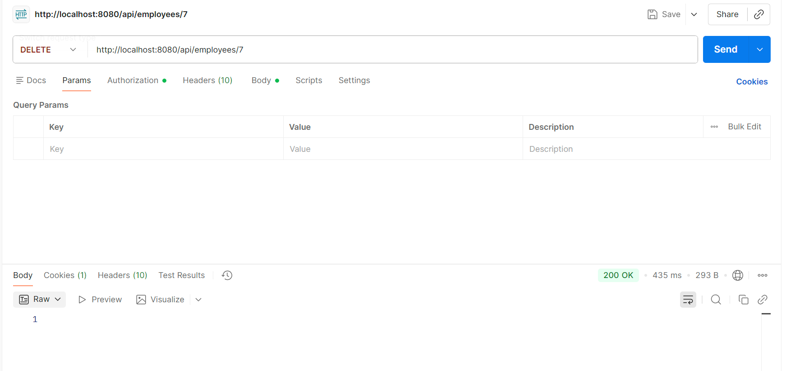
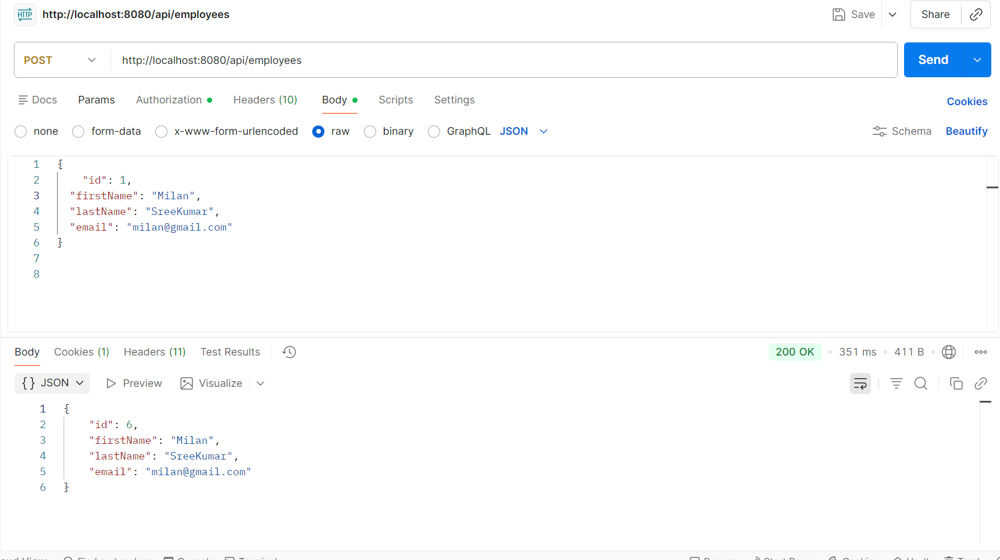

# TalentCore API  
A Secure, Scalable Employee Management REST API built with Spring Boot

---

## Overview

**TalentCore API** is a production-ready backend service designed to manage employee data with a strong emphasis on clean architecture, security, and real-world API design principles.

While the project originated as part of a Spring Boot REST learning module, it has been deliberately extended beyond tutorial scope to reflect **industry-grade backend development practices**. The result is a robust, well-structured REST API that demonstrates how enterprise Java applications are typically built, secured, validated, and documented.

This repository focuses on **clarity, correctness, and extensibility** rather than shortcuts or framework magic.

---

## Project Goals

The primary objectives of this project were to:

- Design a clean, layered backend architecture
- Implement a complete RESTful API with proper HTTP semantics
- Enforce data integrity and validation at multiple layers
- Secure endpoints using Spring Security and BCrypt
- Expose APIs with clear, interactive documentation
- Build something maintainable, not just functional

---

## Architecture

The application follows a **layered architecture**:

Controller → Service → Repository → Database


Key architectural decisions:

- **Controllers** handle request/response mapping only
- **Services** contain all business logic and validations
- **Repositories** abstract persistence using Spring Data JPA
- **DTOs** decouple internal entities from external API contracts
- **Global exception handling** ensures consistent error responses
- **Security layer** is isolated from business logic

---

## Core Features

### Employee Management
- Full CRUD operations for employees
- Partial updates using HTTP PATCH
- Pagination and sorting support for large datasets
- Unique email enforcement at database level
- DTO-based API responses to prevent over-exposure

### Validation & Error Handling
- Field-level validation using Jakarta Validation
- Centralized exception handling with structured JSON responses
- Proper HTTP status codes for all failure scenarios
- Graceful handling of invalid input and edge cases

### Security
- Spring Security integration
- BCrypt password hashing
- User registration endpoint
- Role-based user model
- Protected employee endpoints via authentication

### API Documentation
- OpenAPI / Swagger integration
- Interactive API exploration via Swagger UI
- Auto-generated request/response schemas
- Downloadable OpenAPI specification

---

## Technology Stack

- **Language:** Java 25  
- **Framework:** Spring Boot 4  
- **Persistence:** Spring Data JPA  
- **Database:** MySQL  
- **Security:** Spring Security, BCrypt  
- **Build Tool:** Maven  
- **API Documentation:** Springdoc OpenAPI / Swagger  
- **Testing & Debugging:** Postman, Swagger UI  

---
## Getting Started

### Prerequisites
* **JDK 25** or higher
* **Maven 3.8+**
* **MySQL 8.0+** running on port `3306` (or configured otherwise)

### Installation

1.  **Clone the repository**
    ```bash
    git clone [https://github.com/Asmit159/TalentCore-API.git](https://github.com/Asmit159/TalentCore-API.git)
    cd TalentCore-API
    ```

2.  **Configure the Database**
    Update `src/main/resources/application.properties` with your MySQL credentials:
    ```properties
    spring.datasource.url=jdbc:mysql://localhost:3306/talentcore_db
    spring.datasource.username=root
    spring.datasource.password=your_password
    ```

3.  **Build the Project**
    ```bash
    mvn clean install
    ```

4.  **Run the Application**
    ```bash
    mvn spring-boot:run
    ```

    The API will be available at [http://localhost:8080](http://localhost:8080).

    ---
    
## API Endpoints

### Employee API

| Method | Endpoint | Description |
|------|--------|-------------|
| GET | `/api/employees` | Retrieve all employees |
| GET | `/api/employees/{id}` | Retrieve employee by ID |
| POST | `/api/employees` | Create a new employee |
| PUT | `/api/employees/{id}` | Update an existing employee |
| PATCH | `/api/employees/{id}` | Partially update an employee |
| DELETE | `/api/employees/{id}` | Delete an employee |
| GET | `/api/employees/paged` | Paginated & sorted listing |

### Authentication API

| Method | Endpoint | Description |
|------|--------|-------------|
| POST | `/api/auth/register` | Register a new user |

---

## API Documentation

Swagger UI is available at:

http://localhost:8080/swagger-ui/index.html


Custom OpenAPI paths:

/mu-ui.html
/my-api-docs


All endpoints, schemas, and request formats are documented and testable directly from the UI.

---

## Database Design

### Employee Table
- Auto-generated primary key
- Unique constraint on email
- Managed via JPA/Hibernate

### Users Table
- BCrypt-hashed passwords
- Role-based authorization
- Automatically generated by Hibernate

---

## Validation & Data Integrity

- Input validation enforced at DTO level
- Email format validation
- Mandatory field checks
- Database-level constraints for uniqueness
- PATCH requests validated manually to ensure integrity

---

## Security Notes

- Passwords are never stored in plain text
- BCrypt hashing is applied before persistence
- Authentication is required for protected endpoints
- Security configuration is modular and extensible

---

## Repository Structure

src/main/java/com/luv2code/springboot/cruddemo
  │
- ├── controller
- ├── service
- ├── repository
- ├── entity
- ├── dto
- ├── exception
- ├── security
- └── config


Each package has a single responsibility and minimal coupling.

---

## API Demonstration & Proof of Functionality

The repository includes:
- Swagger screenshots
- Postman request/response samples
- Validation error demonstrations
- BCrypt-hashed password evidence
- Database snapshots

### API Documentation (Swagger)

The API is fully documented using OpenAPI and exposed via Swagger UI for interactive exploration.





### Authentication & Security

User authentication is implemented using Spring Security with BCrypt password hashing.

**User registration**


**BCrypt-hashed passwords stored in database**


**Authorized request (200 OK)**


**Unauthorized request (401 Unauthorized)**


### Validation & Error Handling

The API enforces strict validation rules and returns consistent, structured error responses.

**Validation error example**


**Delete employee operation**


### Core CRUD Operations

Employee creation using REST API.



---

## Future Enhancements

While feature-complete for its scope, the project can be extended with:

- JWT-based authentication
- Role-based endpoint authorization
- Refresh tokens
- Rate limiting
- Integration tests with Testcontainers
- Frontend integration (React / Angular)

---

## Author

**Asmit Mandal**  
Backend Developer | Java & Spring Boot

Feedback, suggestions, and discussions are always welcome.
⭐ this repo, if you like it
---

## License

This project is licensed under the **AGPL-3.0 License**.
